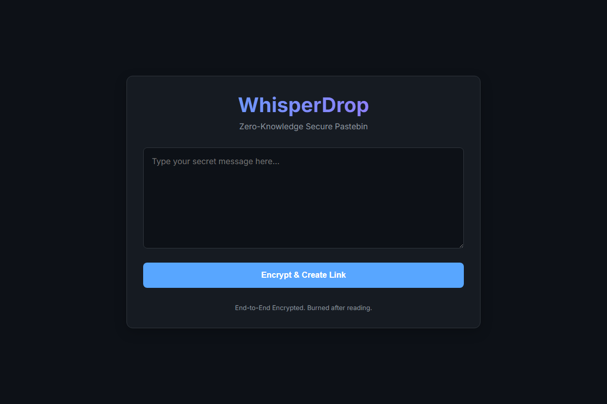
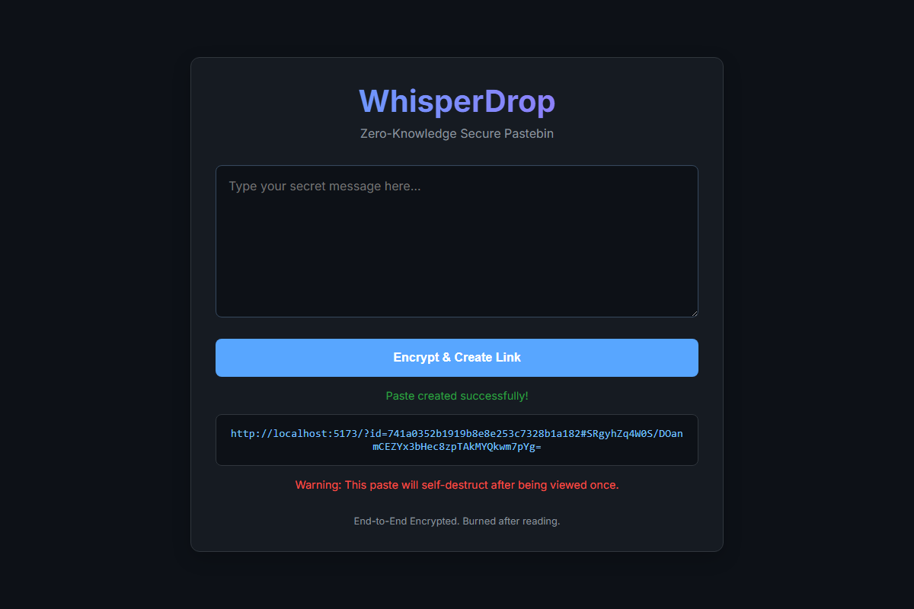
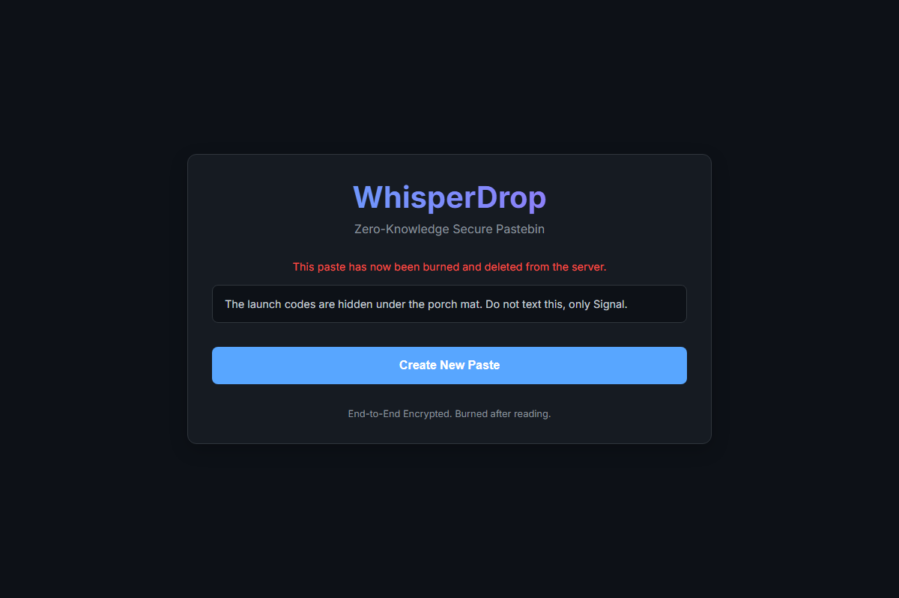
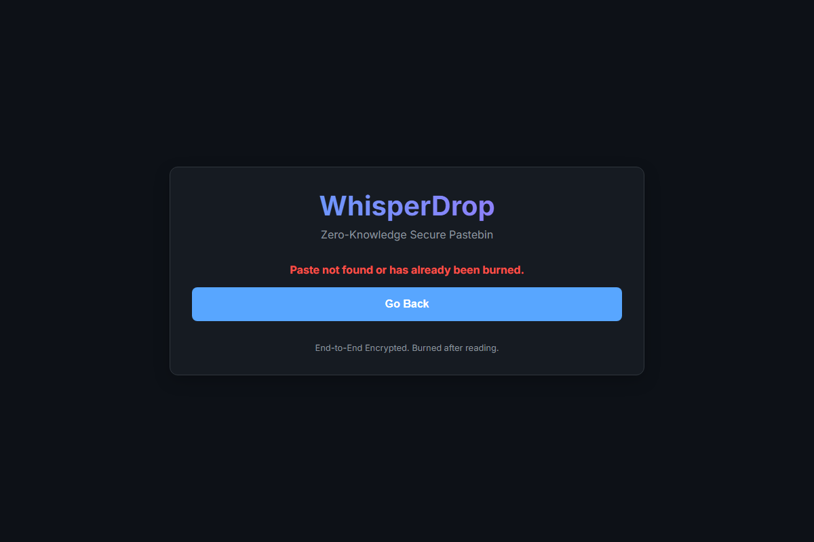

# WhisperDrop

**Zero-knowledge, burn-after-reading pastebin.** Paste a secret, get a link, the server never sees the plaintext — and the paste deletes itself the moment it's opened.

## About

WhisperDrop encrypts your text in the browser with AES-256-GCM before it ever leaves your machine. The encryption key lives only in the URL fragment (`#...`), which browsers never send to a server, so the backend only ever stores ciphertext it cannot read. Once a paste is fetched for viewing, it's deleted from the server immediately — read once, then gone.

- **Client-side encryption** — AES-256-GCM via the Web Crypto API, key generated and exported entirely in-browser.
- **Zero-knowledge server** — the backend stores `{ encryptedData, iv }` and nothing else; it never sees the key or the plaintext.
- **Burn-after-reading** — a paste is deleted from the in-memory store as soon as it's read once.
- **No accounts, no tracking** — create a paste, share a link, done.

## Screenshots

| Create a paste | Link generated |
|---|---|
|  |  |

| Recipient decrypts it | Second visit — already burned |
|---|---|
|  |  |

## How it works

1. Your browser generates a random AES-256-GCM key and encrypts your text with it.
2. Only the ciphertext + IV are sent to the server and stored in memory; the key never leaves your browser.
3. You get a link like `https://.../?id=<paste-id>#<key>` — the key after `#` never gets sent over the network.
4. Opening the link fetches the ciphertext, decrypts it locally with the key from the URL fragment, and the server immediately deletes the paste.
5. Opening the same link again returns "not found" — it's already burned.

## Getting started

```bash
npm install

# Terminal 1 — API server (port 3000)
npm run dev:server

# Terminal 2 — frontend (Vite, port 5173)
npm run dev:client
```

Open `http://localhost:5173`.

## Tech stack

Vanilla JS + Web Crypto API on the frontend (no framework, no build-time crypto deps), Express on the backend with an in-memory store, request size limits, and TTL-based eviction for pastes that are never read.

## Security notes

- The server is a **zero-knowledge relay**: it only ever holds ciphertext and cannot decrypt it.
- The decryption key travels in the URL fragment (`#`), which browsers never include in HTTP requests, so it never touches server logs.
- Pastes are deleted on first read (burn-after-reading) and are also swept out after 24h if never opened.
- This is a demo project — for production use, add persistent storage, HTTPS-only deployment, and rate limiting.

---

<!-- SEO -->
**Topics:** `zero-knowledge` `end-to-end-encryption` `pastebin` `aes-gcm` `web-crypto-api` `burn-after-reading` `self-destructing-messages` `client-side-encryption` `privacy` `secure-sharing` `express` `vite` `javascript`

**Description:** A zero-knowledge, burn-after-reading pastebin — secrets are encrypted client-side with AES-256-GCM and self-destruct after one view.
